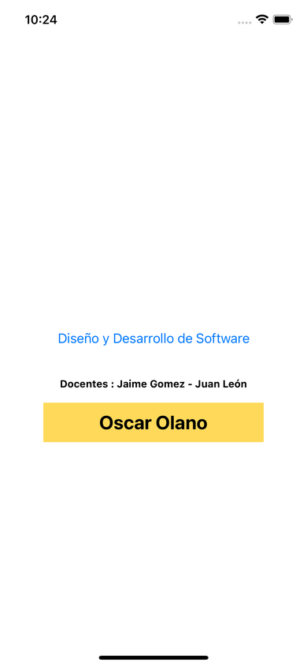
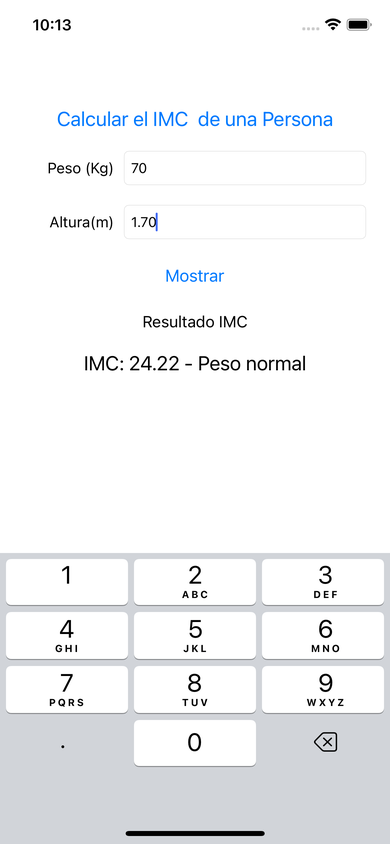
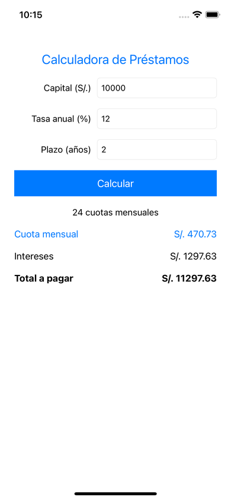

# Semana 05 — Interfaces con UIKit
**Laboratorio 05 · Storyboard, Labels, constraints y controles básicos**

[Volver al inicio](../README.md)

---

## Capturas
<table><tr><td align="center"> Primera app</td><td align="center"> Calculadora de IMC</td><td align="center"> Calculadora de préstamos</td></tr></table>

 Primera app rotada: los constraints mantienen los textos centrados

## Contenido
| Proyecto | Tipo | Descripción |
|---|---|---|
| [`Manual/apple_lab05_UIKit_intro`](Manual/apple_lab05_UIKit_intro) | Manual | Primera app: Labels, Attributes Inspector y constraints |
| [`Manual/Semana05_Desarrollo`](Manual/Semana05_Desarrollo) | Manual | Calculadora de IMC con outlets y acción |
| [`Manual/Semana05_Prestamos`](Manual/Semana05_Prestamos) | Manual | Actividad: calculadora de préstamos (amortización) |

### ¿Qué es y para qué sirve el Jump Bar?
El **Jump Bar** es la barra de navegación que está encima del editor de Xcode y muestra la **ruta jerárquica** del elemento seleccionado, por ejemplo:
`apple_lab05_UIKit_intro › Main › Main (Base) › View Controller Scene › View Controller › View › Label`.

Sirve para:
- **Saber dónde estás**: qué archivo, escena y objeto tienes seleccionado.
- **Navegar rápido**: al hacer clic en cualquier parte de la ruta se despliega un menú para saltar a otro archivo, a otra escena o a otro control de la vista (útil cuando hay elementos pequeños o superpuestos difíciles de seleccionar en el lienzo).
- En archivos de código, su último segmento lista los métodos y propiedades de la clase para saltar a ellos.

### Constraints usados (rotación de pantalla)
| Elemento | Constraints |
|---|---|
| "Diseño y Desarrollo de Software" | Center Horizontally in Safe Area + Center Vertically in Safe Area |
| "Docentes : Jaime Gomez - Juan León" | Vertical Spacing al título + Center Horizontally in Safe Area + Width |
| "Oscar Olano" | Vertical Spacing a los docentes + Center Horizontally in Safe Area + Width + Height |

Sin constraints, al rotar el simulador los Labels quedan en su posición fija y se ven desplazados; con ellos se recolocan respecto al centro del Safe Area.

### Actividad — Calculadora de Préstamos
- `r` = tasa anual / 100 / 12 (tasa mensual)
- `n` = años × 12 (número de pagos)
- Cuota: `M = P × r(1+r)^n / ((1+r)^n − 1)` (si la tasa es 0, `M = P / n`)
- Total a pagar = `M × n`; Intereses = Total − Capital

Ejemplo: capital S/. 10000, 12 % anual, 2 años → r = 0.01, n = 24 → **cuota S/. 470.73**, total **S/. 11297.63**, intereses **S/. 1297.63**.

### Cómo ejecutarlo
Abrir el `.xcodeproj` en Xcode, elegir el simulador **iPhone 14** y presionar  (`Cmd + R`).
