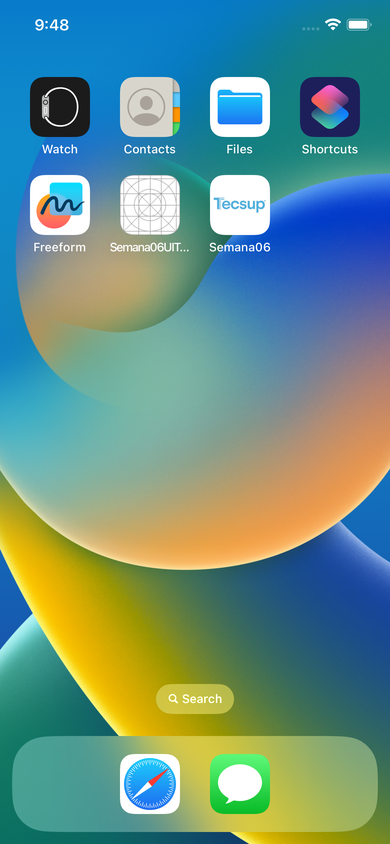
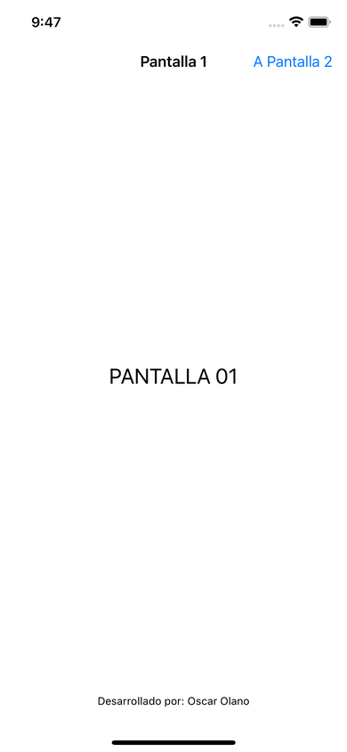
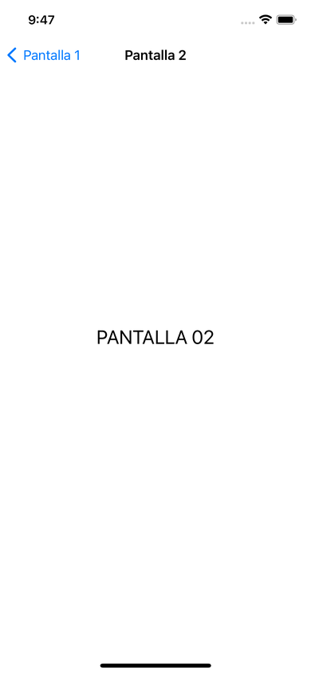
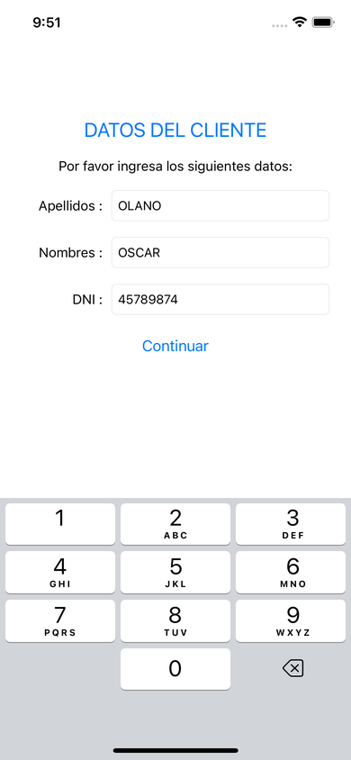
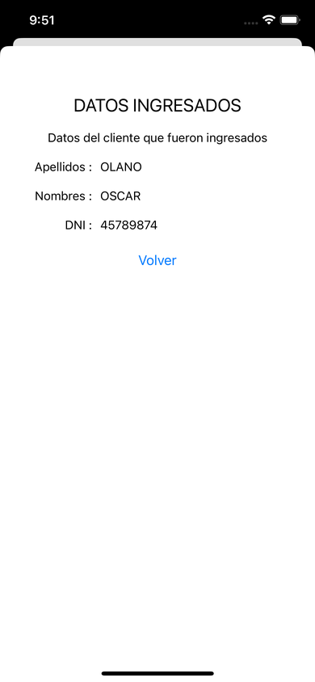
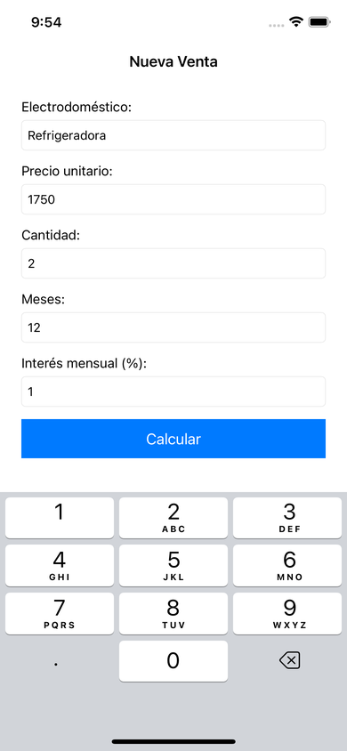
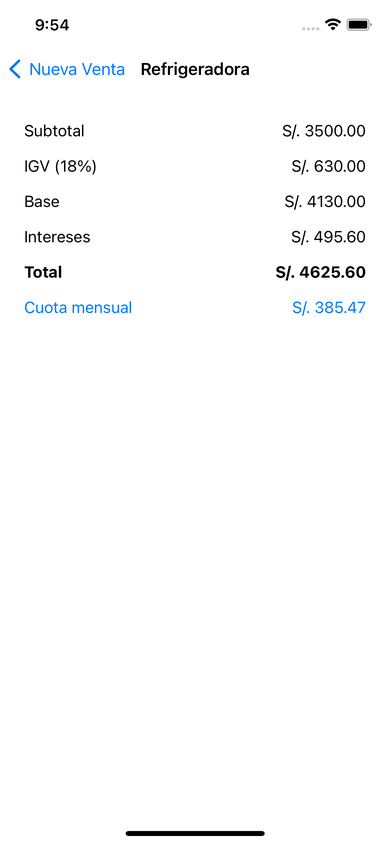

# Semana 06 — ViewControllers y Navegación
**Laboratorio 06 · Navigation Controller, ventanas modales y segues**

[Volver al inicio](../README.md)

---

## Capturas
**Navegación (Semana06)**
<table><tr><td align="center"> Ícono de Tecsup</td><td align="center"> Pantalla 1</td><td align="center"> Pantalla 2 (Show)</td></tr></table>

**Ventanas modales (Semana06_02)**
<table><tr><td align="center"> Datos del cliente</td><td align="center"> Datos ingresados (modal)</td></tr></table>

**Ejercicio 4 con IA (VentaPlazos)**
<table><tr><td align="center"> Nueva venta</td><td align="center"> Resultado</td></tr></table>

## Contenido
| Proyecto | Tipo | Descripción |
|---|---|---|
| [`Manual/Semana06`](Manual/Semana06) | Manual | Navigation Controller, `ViewController2` y segue Show |
| [`Manual/Semana06_02`](Manual/Semana06_02) | Manual | `ClienteModel`, `ViewControllerConfirmacion` y `present` modal |
| [`IA/Lab06-Navegacion`](IA/Lab06-Navegacion) | IA | Calculadora de venta a plazos + PROMPTS |

### Primera parte

#### 16. ¿Qué cambio pudo notar en el diseño de la vista 1?
Al hacer *Editor → Embed In → Navigation Controller*, la vista 1 deja de ser la pantalla inicial: aparece un **Navigation Controller** antes de ella (la flecha de inicio pasa a él) y la vista 1 queda conectada como su *root view controller*. Además, la vista 1 muestra arriba una **barra de navegación** (con espacio para título y botones), donde luego colocamos el botón "A Pantalla 2".

#### 17. ¿Para qué sirve un Navigation Controller?
`UINavigationController` administra una **pila de pantallas**. Cada vez que se navega con un segue *Show* (o `pushViewController`), la nueva pantalla se apila encima y la barra de navegación muestra automáticamente el botón **Back** para regresar (desapilar). Sirve para flujos jerárquicos de "ir al detalle y volver", como Ajustes → General → Información.

#### 29. ¿Para qué sirven Show, Show Detail, Present Modally y Present As Popover?
| Segue | Qué hace | Cuándo usarlo |
|---|---|---|
| **Show** | Empuja la pantalla en la pila del Navigation Controller (con botón Back). | Navegación jerárquica: lista → detalle. |
| **Show Detail** | Reemplaza el panel de detalle de un `UISplitViewController`. En iPhone se comporta como Show/Modal. | iPad o Mac con vista maestro-detalle (Mail, Notas). |
| **Present Modally** | Muestra la pantalla **encima** de la actual (hoja desde abajo), fuera de la pila; se cierra con `dismiss`. | Tareas que interrumpen el flujo: formularios, confirmaciones, login. |
| **Present As Popover** | Muestra la pantalla en una burbuja con flecha que apunta al botón. En iPhone se adapta a modal. | iPad: menús u opciones contextuales pequeñas. |

### Conclusiones

1. **¿Cuándo conviene usar Show y cuándo Present Modally?**
   *Show* cuando el usuario profundiza en una jerarquía y debe poder volver con "Back"; por ejemplo, en WhatsApp, de la lista de chats al chat. *Present Modally* cuando se abre una tarea independiente que se completa o cancela; por ejemplo, la pantalla "Nuevo contacto" o el formulario de pago en una app de delivery.

2. **Show Detail y Present As Popover.**
   *Show Detail* reemplaza el panel derecho de un `UISplitViewController` y tiene sentido en **iPad** (y Mac), como Mail o Notas. *Present As Popover* muestra una burbuja anclada a un botón y tiene sentido en **iPad**; en iPhone ambos se adaptan a una presentación de pantalla completa o modal.

3. **¿Qué pasaría si ClienteModel o VentaModel fueran struct?**
   No se rompería el paso de datos hacia adelante: al asignar `oPantalla2.pCliente = oCliente` se copiaría el valor y la pantalla destino igual mostraría los datos. La diferencia es que `struct` es un tipo por **valor** (cada pantalla tendría su propia copia) y `class` es por **referencia** (ambas comparten el mismo objeto). Si la pantalla 2 modificara el modelo, con `class` la pantalla 1 vería el cambio y con `struct` no. Además, al heredar de `NSObject` el modelo tiene que ser `class`.

4. **¿Qué diferencia notaste entre el Ejercicio 2 (manual) y el Ejercicio 4 (con IA)?**
   [Completa con tu experiencia: tiempo que te tomó cada uno, qué entendiste mejor al hacerlo a mano y qué aprendiste del código de la IA, por ejemplo `guard let` y `shouldPerformSegue`.]

### Cómo ejecutarlo
Abrir el `.xcodeproj` en Xcode, elegir el simulador **iPhone 14** y presionar  (`Cmd + R`).
